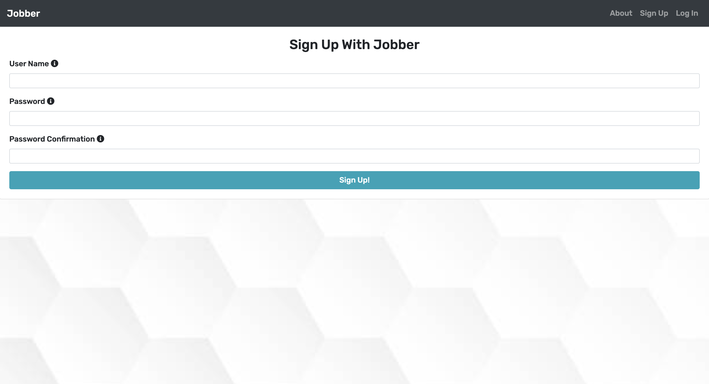
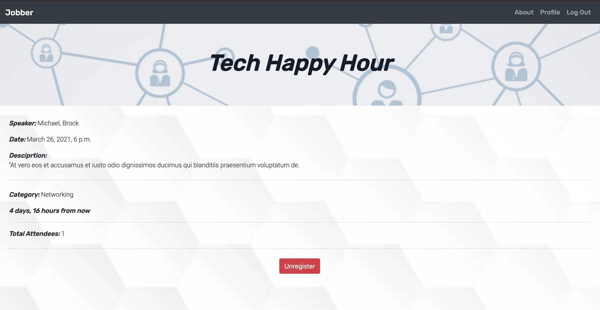
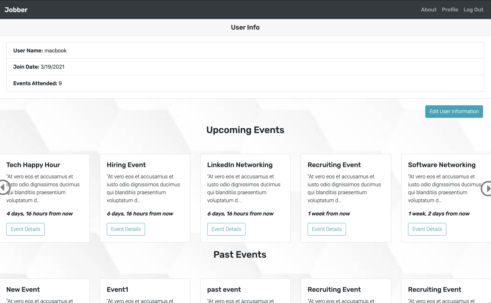
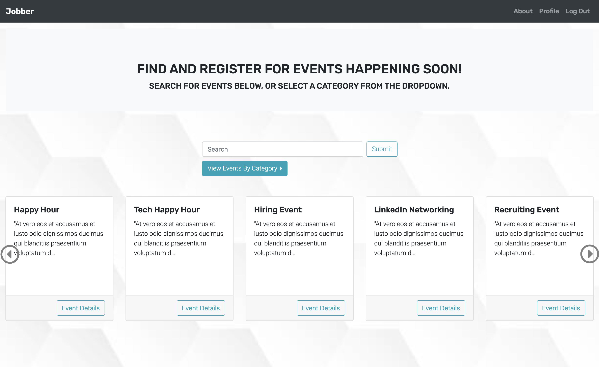

# Jobber

## Link to deployed project
https://jobber-119.herokuapp.com/

## Project Description
A site where users can search and register for recruiting events with a profile page that allows user to keep track of upcoming and past events as well as change username and password. This project was built using Django and on the premise of a client commissioning us "to build an app where they can post and promote various recruiting events. Due to COVID-19, events will be held remotely for the time being so special consideration will need to be made for these events"

## List of the Technologies Used
* HTML
* CSS
* Javascript
* Bootstrap
* Django
* jQuery

## Installation Instructions
#### 1. Set Up virtual environment

- `python3 -m venv .env`
- `source .env/bin/activate`

#### 2. Install packages from requirements.txt
- `pip3 install -r requirements.txt`

### 3. Migrate (if it is the first time setting up the database)
- `python3 manage.py migrate`

## User Stories

### Sprint 1: Basic Auth & Profiles

* Navigate to "/" and see a basic splash page with:
    * The name of the website.
    * Links to "Log In" and "Sign Up"
    * Sign up for an account.
    * Log in to their account if they already have one.
* Be redirected to their public profile page after logging in.
* On their public profile page, see their name, and their join date.
* See the site-wide header on every page with:
    * A link to "Log Out" if they're logged in.
    * Links to "Log In" and "Sign Up" if they're logged out.
* Update their profile by making changes to their name.
* An admin user should be able to add events through the admin panel.

### Sprint 2: CRUD

* View a single event page (at "/events/1") including:
* The event title, date, and time.
* The name of the speaker or speakers.
* The industry focus of the event (tech workers/content creators/marketing etc.)
* A button to register for the event which reveals the link to join the event (links don't need to actually open a call).
* View a list of events on the Home page:
    * Sorted by date with the nearest event appearing first.
    * With the event titles linked to the individual event "show" pages.
    * Use a search field to refine event results with specific keywords.
    * Use buttons to filter results by industry or type.
* For events that the user has already registered for, show an icon or note indicating that to the user. Users can not register for events more than once.
* Click "unregister" on ANY registered event to remove them from the guestlist, then:
    * See a pop-up that says: "Are you sure you want to cancel your registration?"
    * If the user confirms, take them off the event guestlist.
* Visit event pages via pretty urls, like "/events/node-jobs".
* On the homepage:
    * See event descriptions truncated to 1000 characters max, with a link to view more - do not display event details on the homepage. A user should have to click into the event to find out more information.
    * See a relative event date, e.g. "2 days from now".

### Sprint 3: Validations & Authorization

* Verify that an event they register for is successfully added to the profile page.
* A user CANNOT save invalid data to the database, according to the following rules:
    * A user CANNOT sign up with an email (or username) that is already in use.
    * A user can update their password. Passwords should have atleast 8 characters, one capital letter, one number, and one special character.
* An event must have a title, date, time, speaker, and description to be listed on the site.
* A user MUST be logged in to register/unregister for events and change their profile.
* A user may only edit their own profile and register/unregister themselves from events.
* View an error message when form validations fail, for the following validations:
    * Passwords should have atleast 8 characters, one capital letter, one number, and one special character.
    * View only the 10 most recent events on the homepage (use pagination), with
* A link/button to the "Next" 10.
* A link/button to the "Previous" 10.
* See a list of past events they've registered for on their public profile
* See the number of total events they've attended.
* An admin user should be able to:
    * See the number of registrants an event has on the event's "show" page.

## Screenshots

 
## Wireframes

## Unsolved problems/Major Hurdles

For the user stories:
* See event descriptions truncated to 1000 characters max, with a link to view more - do not display event details on the homepage. A user should have to click into the event to find out more information.
* See a relative event date, e.g. "2 days from now".
At first it seemed to require using multiple methods and logic to complete them but as I researched more into it, I found out that Django has a lot of packages and built in methods that can be used. I found the humanize package that Django has to offer which handles the dateTime property in many different ways and can transform them to be readable in the way that the developer wants it to be. I really enjoyed diving deeper into the documentation and finding already created methods to elevate the application.

## Future Development

For future development of the application, adding a 
photo component to it will bring the site more color and user interactions. I would like to add a feature for photos to be uploaded by users of the event or to add a comment section to the event for any questions or comments they have about the event before and after it. 

An additional feature could also be to have the page more accessible to admins and allow them to view more details about an event and users' information directly on the application. 
